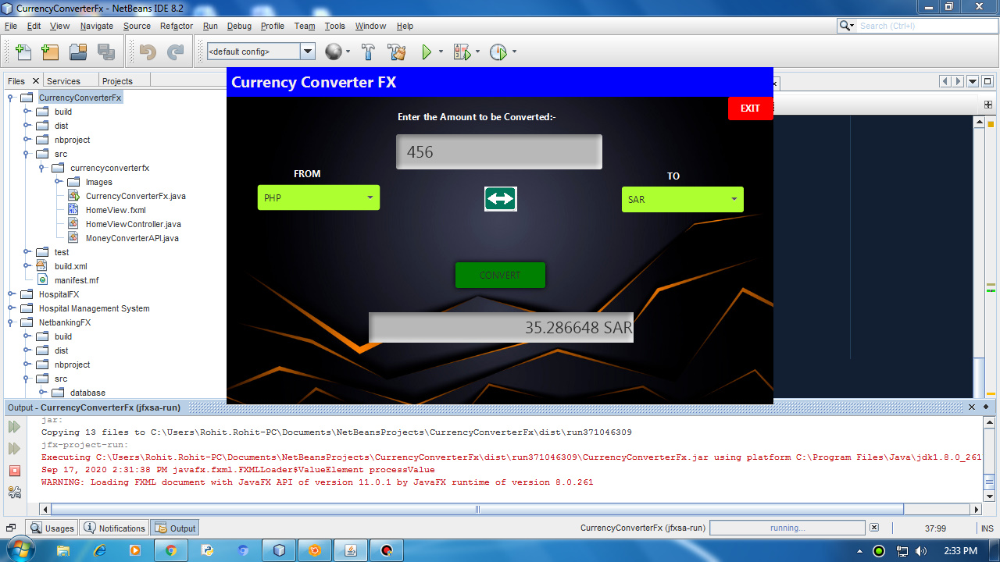
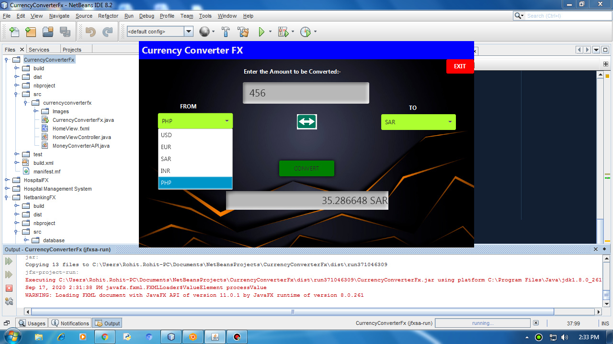
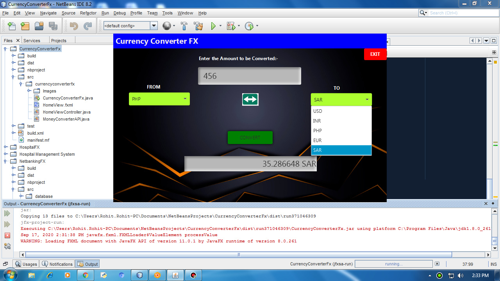

# Currency-Converter-Application

### What it does:
This is a simple project in core Java that provides real time conversion from one currency(say USD) to another currency(say INR).
I have used an API to establish Client server Connection that provides real time Conversion.

### Features of the API:
The API that I have implemented in this project have the following attributes:
1.Currency Pairs per Request: 2
2.Number of Requests per Hour: 100
I am using the free tier service of the API so the rates gets updated on a daily basis.

### Usage:
TO run my project You just need to change a line in code of MoneyConverterAPI.java file that states "ENTER_YOUR_UNIQUE_KEY" with 
your unique key generated from the API website and you are all set to go.
you just need to register yourself on the website https://free.currencyconverterapi.com/ and then you will be provided with your unique key.

### Screenshots:

